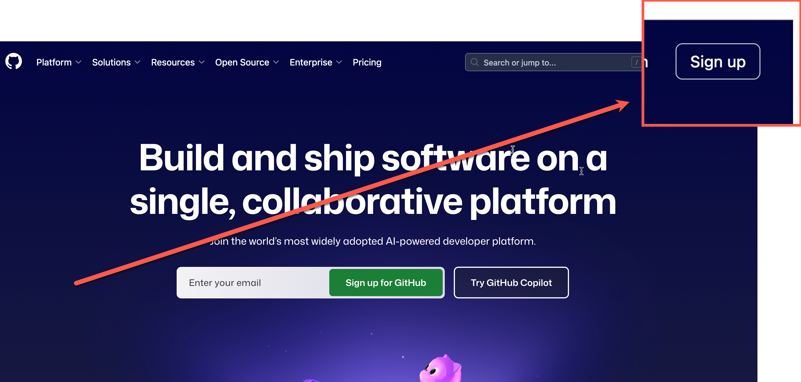

# Lab: Setting Up a Free Account (and optional local development environment)

These are the steps to set up a free GitHub account and optionally configure a local development environment using Visual Studio Code and GitHub Copilot.

## 1. Check your environment

1. Install Microsoft Edge or Google Chorome browser on your computer.
   - [Download Microsoft Edge](https://www.microsoft.com/edge)
   - [Download Google Chrome](https://www.google.com/chrome/)
2. Ensure you can access github.com, github.dev, and any related GitHub services in your browser.

**Note:** If you are using a corporate or institutional network, ensure that these sites are not blocked by your firewall or network policies. You may need to contact your IT department for assistance.

## 2. Create a Personal GitHub Account

Before setting up GitHub Copilot, you'll need a personal GitHub account. If you don't already have one, follow these steps:

1. **Visit GitHub's Sign-up Page**
   1. Go to [github.com](https://github.com)
   2. Click on the "Sign up" button in the top right corner
    

2. **Create Your Account**
   1. Enter your email address
   2. Create a secure password
   3. Choose a unique username (this will be part of your GitHub profile URL)
   4. Choose whether you want to receive product updates via email
   5. Verify you're human by solving the puzzle
   6. Click "Create account"

3. **Verify Your Email**
   1. Check your email inbox for a verification message from GitHub
   2. Click the verification link in the email
   3. Complete any additional setup steps as prompted

## 3. Apply for Github Copilot in training session

## 4. (Optional) Setup Visual Studio Code & Github Copilot Extension

If you plan to use Visual Studio Code in your machine. You can set up the GitHub Copilot extension to enhance your coding experience. Follow these steps:

1. Ensure you have Visual Studio Code installed on your computer.
   - [Download Visual Studio Code](https://code.visualstudio.com/)

2. Follow these steps to add the Visual Studio Code extension for GitHub Copilot.

   1. In the Visual Studio Code Marketplace, Add following Visual Studio Code's extension: 
      1. [Github Copilot](https://marketplace.visualstudio.com/items?itemName=GitHub.copilot)
      2. [Github Copilot chat](https://marketplace.visualstudio.com/items?itemName=GitHub.copilot-chat)
    
   2. **If you haven't previously authorized Visual Studio Code in your GitHub account**, you're prompted to sign in to GitHub in Visual Studio Code. 
      1. Select Sign in to GitHub
   3. If you have multiple GitHub accounts, You might have to sign out, sign-in and select the account you want to use with GitHub Copilot.
    

